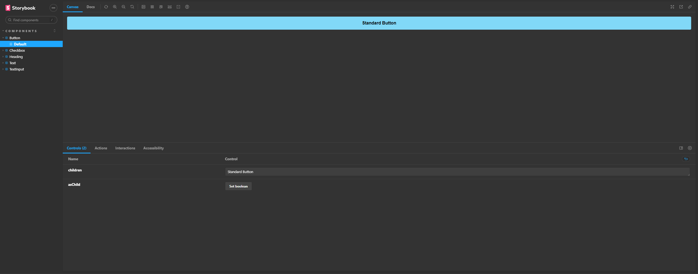

# Rocketseat Bootcamp: Ignite Lab

<h1 align="center"> </h1>
<h1 align="center"> </h1>

**About this Project:**

The objective of this project is to make components and present them separately using storybook library developed to present the components.

This presentation of the components seeks to facilitate decision communication among the team.

In this specific case, my [project](https://antoniobordignon.github.io/ignite-lab/?path=/story/components-heading--small) is available on github pages so that everyone can enter, look and edit the components, thus checking which version is best for the project.

Finally, the [webpage](https://ignitelabdesignsystem.netlify.app) using these components is also available.

**Technologies**

- React
- TypeScript